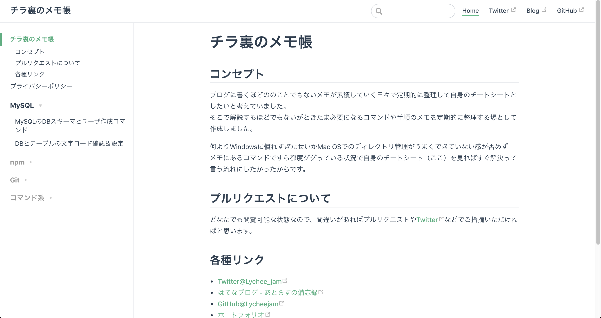

# What's this...

Vuepress `0.X系`用のサイドバー自動生成ユーティリティです。

# Installation

```sh
npm install vuepress-sidebar-generator
```

# Usage

`config.js` 内の `sidebar` セクションで使用します。

## Example1

この方法は自動でサイドバーのメニューを生成します。  
グループのタイトルについてはディレクトリ名となります。  

* Site：[チラ裏のメモ帳 \| チラ裏のメモ帳](https://cheatsheet.kitigai.org/)

```sh
$ tree -a docs
docs
├── .vuepress
├── README.md
└── privacy.md
├── command
│   └── curl_response_code.md
├── git
│   ├── local_rollback.md
│   └── stash.md
├── mysql
│   ├── create_db_and_user.md
│   └── db_and_table_character_set.md
└── npm
    └── package_update.md
```

* `config.js`

```js
// module import
const sidebar = require('vuepress-sidebar-generator')

module.exports = {
  themeConfig: {
    // call method
    sidebar: sidebar.getSidebarList()
  }
}
```

## Example2

この方法ではグループのタイトルを指定することが出来ます。  
しかし、まだ問題があるためTOPレベルのパスを手動で設定する必要があります。

```sh
$ tree -a docs
docs
├── .vuepress
├── README.md
└── privacy.md
├── command
│   └── curl_response_code.md
├── git
│   ├── local_rollback.md
│   └── stash.md
├── mysql
│   ├── create_db_and_user.md
│   └── db_and_table_character_set.md
└── npm
    └── package_update.md
```

* `config.js`

```js
// module import
const sidebar = require('vuepress-sidebar-generator')

module.exports = {
  themeConfig: {
    sidebar: [
      '',   //top level README.md
      '/privacy',
      sidebar.getSidebarGroup('/mysql/', 'MySQL', true),
      sidebar.getSidebarGroup('/npm/', 'npm', true),
      sidebar.getSidebarGroup('/git/', 'Git', true),
      sidebar.getSidebarGroup('/command/', 'コマンド系', true)
    ]
  }
}
```



# 今後について

JS素人なのでリファクタ大歓迎です。  
上記の例以外のメニュー生成パターンも整備予定です。
